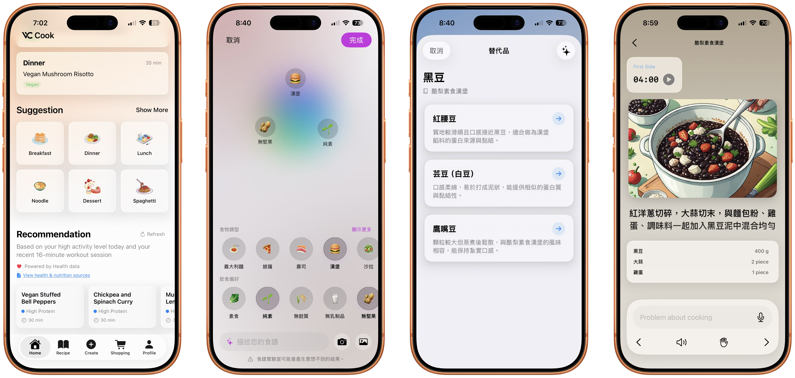

# Demo Blog 1

Welcome to your first blog post stored in **VC_Blog**.

## Why this setup

- Content is versioned in GitHub.
- The website reads from GitHub Raw.
- You can update posts without changing app code.

## Quick checklist

1. Add a new markdown file under `blog/`.
2. Add an item in `blogs.json` with `markdown_path`.
3. Commit and push.

## Example image

## Example link

Read more on [your GitHub profile](https://github.com/Galile-Vincent).
